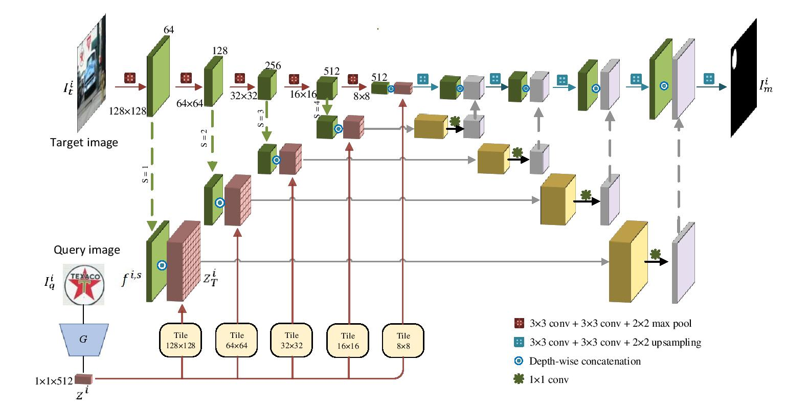
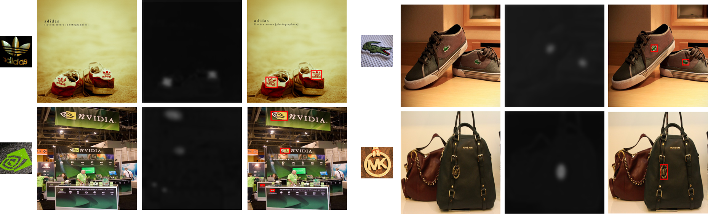

# A Deep One-Shot Network for Query-based Logo Retrieval
**Ayan Kumar Bhunia**, Ankan Kumar Bhunia, Shuvozit Ghose, Abhirup Das, Partha Pratim Roy, Umapada Pal “A Deep One-Shot Network for Query-based Logo Retrieval”. Under Review at Pattern Recognition Journal, Elsevier.

## Abstract
Logo detection in real-world scene images is an important problem with applications in advertisement and marketing. Existing general-purpose object detection methods require large training data with annotations for every logo class. These methods do not satisfy the incremental demand of logo classes necessary for practical deployment since it is practically impossible to have such annotated data for new unseen logo. In this work, we develop an easy-to-implement query-based logo detection and localization system by employing a one-shot learning technique using off the shelf neural network components. Given an image of a query logo, our model searches for it within a given target image and predicts the possible location of the logo by estimating a binary segmentation mask. The proposed model consists of a conditional branch and a segmentation branch. The former gives a conditional latent representation of the given query logo which is combined with feature maps of the segmentation branch at multiple scales in order to obtain the matching location of the query logo in a target image, should it be present. Feature matching between the latent query representation and multi-scale feature maps of segmentation branch using simple concatenation operation followed by $1\times1$ convolution layer makes our model scale-invariant. Despite its simplicity, our query-based logo retrieval framework achieved superior performance in FlickrLogos-32 and TopLogos-10 dataset over different existing baselines. 


## Architecture




## Qualitative Results




## Citation

If you find this article useful in your research, please consider citing:
```
@article{bhunia2018query,
  title={A Deep One-Shot Network for Query-based Logo Retrieval},
  author={Bhunia, Ayan Kumar and Bhunia, Ankan Kumar and Ghose, Shuvozit and Das, Abhirup and Roy, Partha Pratim},
  journal={arXiv preprint arXiv:1811.01395},
  year={2018}
}
```
